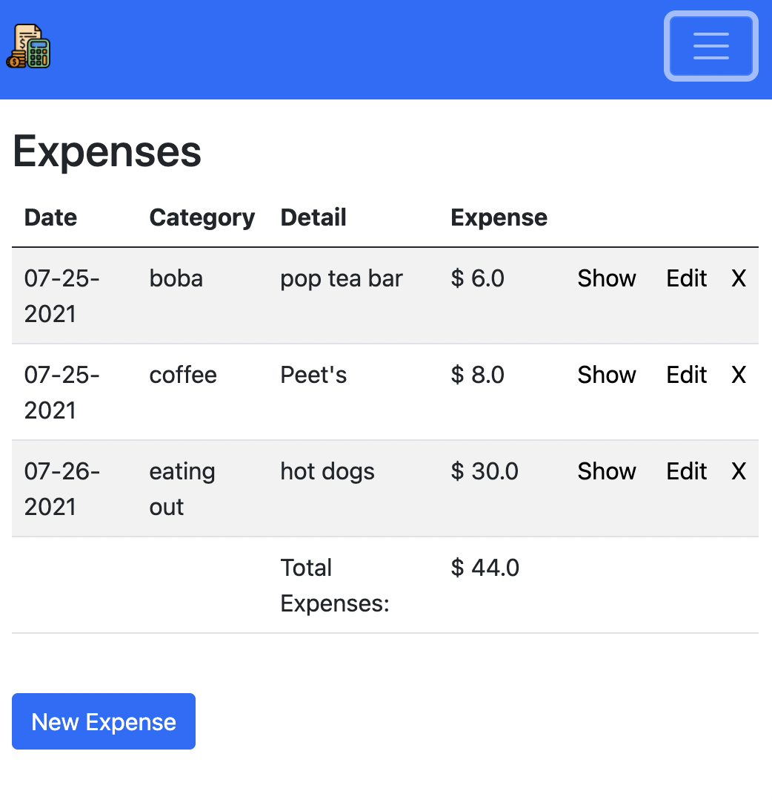

## ExpenseTracker

> expense tracking app

<!-- ## [demo](https://expensetracker2.herokuapp.com/) -->

[](https://expensetracker2.herokuapp.com/)

## instructions
```
git clone https://github.com/adnjoo/ExpenseTracker
bundle i
yarn
rails s
```
## screencast 
[](https://www.youtube.com/watch?v=G8bcbaUSt9M)

## tech stack

Ruby on Rails, Bootstrap, Postgres

